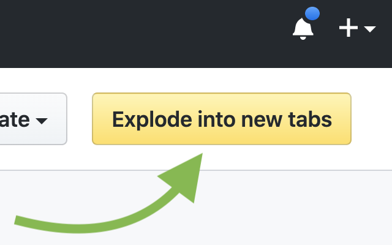

# github-exploder
A Chrome extension that explodes your unread GitHub notifications in new tabs.

Download at: https://chrome.google.com/webstore/detail/github-exploder/ddndeeokidhgefflhohhcjjgjhgfbhac

## Usage instructions

While logged into your GitHub account, visiting https://github.com/notifications will reveal a new button if you have GitHub notifications. When this button is clicked, the extension will open all of your unread notifications into new tabs.

